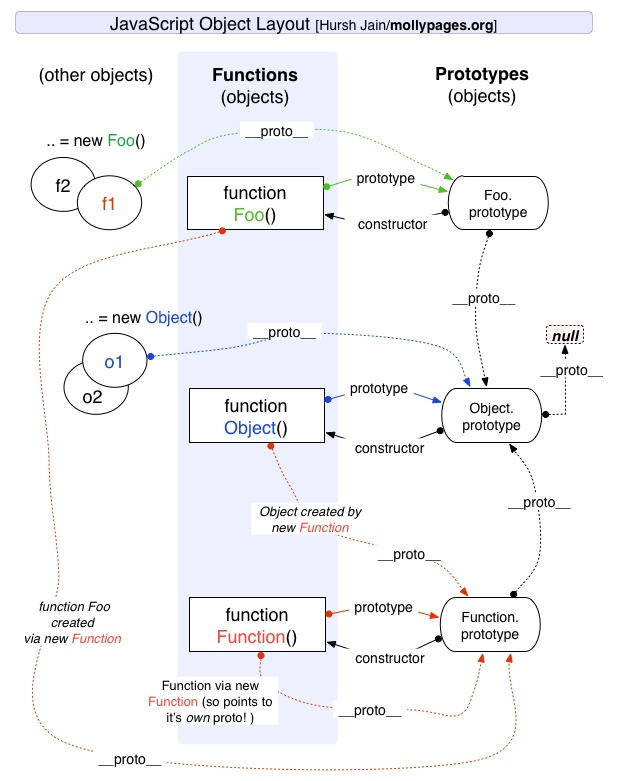

JavaScript
===

对象
---
对象是 JavaScript 的基本数据类型。它是属性的无序集合，每个属性都是一个Key/Value对。对象除了可以有自有属性(own property)外，还可以从原型对象继承属性(inherited property)。JavaScript对象的属性可以新增修改或删除。 

JavaScript 的属性有一些与之相关的值，称为 property attribute：

- writable attribute  
 是否可以设置该属性的值
 
- enumerable attribute  
 是否可以通过for/in循环返回该属性

- configurable attribute  
 是否可以删除或者修改该属性

除属性外，每个对象还拥有三个相关的 object attribute：

- prototype  
 指向另一个对象。对象的属性继承自它的原型对象
 
- class  
 标识对象类型
 
- extensible flag  
 是否可以向对象添加新属性

JavaScript 使用 **引用** 来操作对象。

### 创建对象

可以通过如下几种方式创建对象。

#### 对象直接量

对象直接量是由若干 Key/Value对组成的映射表。如下：

```
var empty = {};
var point = { x: 0, y: 1};
```

#### new

使用 `new` 后跟随一个构造函数的方法来创建一个对象。如：

```
var o = new Object();
```

#### Object.create()
在说 `Object.create()` 方法之前，先说下原型。每个JavaScript对象（null除外）都和原型对象相关联。所有通过对象直接量创建的对象都具有同一个原型对象，可以使用 `Object.prototype` 来获得对原型对象的引用。通过 `new` 和构造函数创建的对象的原型就是构造函数的 prototype 属性值。

`Object.create()` 的提供两个参数，第一个是对象的原型，第二个是可选的，用来对对象的属性进行进一步的描述。如下：

```
var o1 = Object.create({x:1, y:2});        // o1 继承属性x和y
var o2 = Object.create(Object.prototype);  // 与{}和new Object()一样。
```

原型
---
JavaScript 中类的实现不是基于类继承方式，而是基于原型继承。如果两个实例都是从同一个原型对象上继承属性，则它们是同一个类的实例（duck-typing）。

对于如下代码：
```
var x = 2, b = 1;

function add(x, y) {
    return x + y
}

function sub(x, y) {
    return x - y
}
```

对于上述实现方法，没有做到对于重用代码和模块开发，上述代码显得不够优雅。使用如下方式来美化一下：

```
function Calculator(x, y){
    this.x = x;
    this.y = y;
}

Calculator.prototype = {
    add: function(x, y) {
        return x + y;
    }

    sub: function(x, y) {
        return x - y;
    } 
}
```
以后可以通过new得到一个Calculator对象，然后调用其方法。

### 原型链
对象的原型链由对象的原型继承关系组成。当查找一个对象的属性时，JavaScript会向上遍历原型链，直到找到给定名称的属性为止。若查找到原型链的顶部--Object.prototype 仍没有找到指定的属性，则返回undifined。

以下是mollypages关于原型的一张图：



下面是一个测试代码：

```
function Foo() {}
var foo=new Foo();
alert(foo instanceof Foo);//true
alert(foo instanceof Object);//true
alert(foo instanceof Function);//false
alert(Foo instanceof Function);//true
alert(Foo instanceof Object);//true
```

### \_\_proto\_\_ 与 prototype

`__proto__` 指向对象的内部原型，`prototype` 指向构造器原型。

对于大多数JavaScript实现而言，每一个对象都有一个 `__proto__` 属性，原型链正是基于 `__proto__` 属性来实现的。不过 `__proto__` 不是一个标准的做法，部分浏览器不能直接访问它，不应该出现在代码中。

每个JavaScript函数（除 `Function.bind()` 返回的函数外）都自动拥有一个 `prototype` 属性。该属性的值是一个对象，这个对象包含唯一一个不可枚举的属性`constructor`, `constructor`属性的值是一个函数对象。

```
var F = function(){};           //F是一个函数对象
var p = F.prototype;            //p是F相关联的原型对象
var c = p.constructor;          //c是原型相关联的函数
c === F                         // 即对任意函数有 F.prototype.constructor == F
```

构造函数的原型中存在预先定义好的 `constructor` 属性，这意味着对象继承的`constructor` 属性均指代它们的构造函数。

```
var o = new F();       // 创建类F的一个对象
o.constructor === F;   // true, 对象的constructor属性指代这个类。
```

通过`new`和构造函数创建的对象原型就是构造函数的prototype属性。关于`new`操作符，先看如下代码：

```
function Foo(){}
var foo = new Foo();
```

JavaScript在new的过程中，做了如下操作：

1. 创建类实例  
 这里将一个空对象的 `__proto__` 属性设置为 `F.prototype`
2. 初始化这个实例  
 调用带参的函数F，并将`this` 指定为该实例。
3. 返回实例  

即`var foo = new Foo()`相当于如下代码：

```
var foo = { __proto__: Foo.prototype};
Foo.apply(foo, agruments);
return foo;
```

从上面可以看出，**所有对象的 `__proto__` 都指向其构造函数的 `prototype` 属性**。在JavaScript中函数也是对象，且所有function的基类都是`Function`，因此所有构造函数（包括`Object`）的 `__proto__` 都指向 `Function.prototype`（原型对象）。对象（包括`Function`）都继承自`Object`，由于所有对象的 `__proto__` 属性都指向其构造函数的`prototype` 属性，因此原型对象的 `__proto__` 都指向`Object.prototype`。`Object.prototype`的 `__proto__` 指向 `null` 。

可以看到，`Object` 和 `Function` 相互影响， `Function` 继承自 `Object`，而 `Object.__proto__ === Function.prototype`。


Reference
---

- [JavaScript Object Layout](http://www.mollypages.org/misc/js.mp)
- [How prototypal inheritance really works](http://blog.vjeux.com/2011/javascript/how-prototypal-inheritance-really-works.html)
- [JavaScript核心](http://www.cnblogs.com/TomXu/archive/2012/01/12/2308594.html)
- [Object.prototype](https://developer.mozilla.org/en-US/docs/Web/JavaScript/Reference/Global_Objects/Object/prototype)
